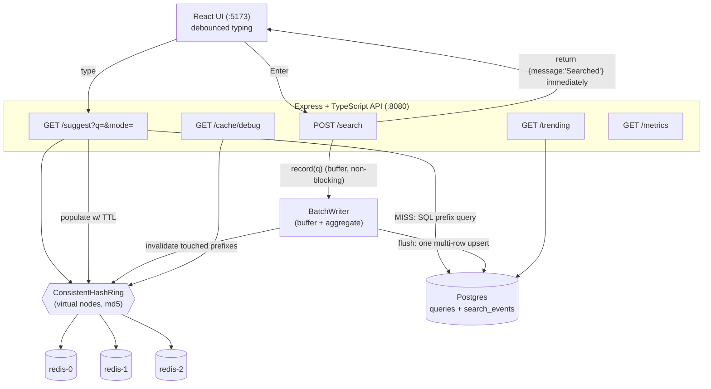

# Architecture — Search Typeahead System

This document explains how the system is put together, the data model, the read and write
paths, and the design choices with their trade-offs. It doubles as the high-level talking
points for the viva.

## 1. Request-flow diagram



**Read path (`GET /suggest`):** normalize the prefix → the consistent-hash ring picks the
owning Redis node → **cache HIT** returns the cached top-10 immediately; **MISS** runs a SQL
prefix query against Postgres (`WHERE query LIKE 'p%' ORDER BY count DESC LIMIT 10`, a bounded
index scan), ranks the matches, stores the result on the owning Redis node with a TTL, and
returns it. This is **cache-aside**.

**Write path (`POST /search`):** return `{"message":"Searched"}` *immediately* and buffer the
query in the in-memory `BatchWriter` (an O(1) map increment) — **no synchronous DB write**.
Periodically (or when the buffer fills) the writer flushes aggregated counts to Postgres in a
single multi-row upsert, appends one `search_events` row per query (for recency), and invalidates
the affected cache entries. The new counts are now in Postgres, so the next cache miss reads them
via the prefix query — there's no in-memory index to rebuild.

## 2. Components

### Prefix search (`store/QueryStore.ts` → `searchPrefix`)
Suggestions on a cache miss come from a SQL prefix query:
`SELECT query, count FROM queries WHERE query LIKE 'p%' ORDER BY count DESC LIMIT 10`. The key to
making this fast is the **`idx_queries_prefix`** index built with the `text_pattern_ops` operator
class: a normal text index sorts by the DB's collation (which `LIKE 'x%'` can't range-scan), whereas
`text_pattern_ops` sorts by byte order, turning the query into a **bounded range scan** of just the
matching prefix (verified via `EXPLAIN` → `Bitmap Index Scan`, not `Seq Scan`). The user's prefix is
a bound parameter (no SQL injection) and its LIKE wildcards (`%` `_` `\`) are escaped (no pattern
injection). This only runs on a miss (~1% of reads); the cache absorbs the rest. *(A classic
alternative is an in-memory trie answering in O(prefix length); we chose SQL to keep Postgres the
single source of truth with no second index to keep in sync.)*

### Consistent-hash ring (`cache/ConsistentHashRing.ts`)
Our own implementation — **not** Redis Cluster — so routing is explainable and observable via
`/cache/debug`. Both nodes and keys are hashed onto a 2³² ring with **md5** (deterministic and
stable across restarts; we use only its bits for placement, not its security). Each physical
node is placed at **150 virtual-node** positions so load is even across only 3 nodes and a
departing node's keys spread across all survivors instead of dumping on one neighbour.
`getNode(key)` does a binary search for the first ring position ≥ the key's hash (wrapping
around). **The headline property:** adding/removing a node only re-homes the ~1/N of keys in
that node's arc — verified at ~1/4 when adding a 4th node — versus `hash % N`, which changes
the modulus for almost every key and effectively wipes the cache.

### Cache service (`cache/CacheService.ts`, `cache/RedisCacheNode.ts`)
The cache-aside facade routes each prefix through the ring to one Redis node. Entries carry a
**60s TTL** (a staleness bound that holds even if explicit invalidation is missed) and are also
**invalidated on flush** when rankings change (the fast path). If a Redis node is unreachable,
reads degrade to a **miss** (read from Postgres) rather than erroring a keystroke. Cache keys
are **mode-namespaced and length-prefixed** (`${mode}:${q.length}:${q}`) so basic and recency
results never collide. Hits/misses are recorded for the hit-rate metric.

### Batch writer (`batch/BatchWriter.ts`)
Buffers submissions in a `Map<query, delta>` so repeats aggregate (50× "iphone" → one `+50`
upsert). Flushes on **size** (`BATCH_SIZE` = 500 distinct queries) **or time** (`BATCH_FLUSH_MS`
= 2s), whichever first. The DB upsert and cache invalidation are **injected callbacks**, so the
module is unit-testable with no DB. On `onFlush` failure it **re-queues** the snapshot (nothing
lost). It tracks `writesSaved = totalSubmissions − totalDbWrites` — the write-reduction evidence.
**Failure trade-off:** a hard crash before a flush loses up to ~`BATCH_FLUSH_MS` of buffered
counts; a graceful shutdown flushes the tail. (A WAL could close that gap at the cost of
write-amplification — unnecessary for an analytics-style counter where a few lost increments are
tolerable.)

### Recency ranking (`ranking/recency.ts`)
Blends popularity and recent activity: `score = 3·count1h + 1.5·count24h + 1·allTimeCount`
(weights from config). 1h is weighted highest so a current burst can out-rank an all-time
favourite (= "trending"); all-time is the baseline so the enhanced ranking degrades gracefully
to the basic one when nothing is trending. Window counts come from `search_events` via
`SUM(hits)`.

### Primary store (`store/QueryStore.ts`, `store/schema.sql`)
The only module that touches Postgres. It owns the prefix search (`searchPrefix`, above), the
window-count queries for recency, and the flush. The flush is **one parameterized multi-row upsert**
(`INSERT ... VALUES (...),(...) ON CONFLICT (query) DO UPDATE SET count = count + EXCLUDED.count`)
— N aggregated queries = one round-trip. It tracks `dbReads`/`dbWrites` for the metrics.

## 3. Data model

```sql
queries(
  query         TEXT PRIMARY KEY,   -- the query text is the natural key
  count         BIGINT NOT NULL,    -- lifetime/all-time count
  last_searched TIMESTAMPTZ
)

search_events(
  id    BIGSERIAL PRIMARY KEY,
  query TEXT NOT NULL,
  hits  INTEGER NOT NULL DEFAULT 1, -- aggregated searches for this query in one flush
  ts    TIMESTAMPTZ NOT NULL DEFAULT now()
)
```

**Why two tables:** `queries` answers "how popular *ever*?" (the prefix search reads it);
`search_events` answers "how popular *lately*?" (the recency windows aggregate it).

**Why "one aggregated row per flush" + `SUM(hits)` (not one row per search + `COUNT(*)`):**
a query searched 50 times in a flush writes **one** row with `hits = 50`, not 50 rows. Event-row
volume is then bounded by *distinct queries per flush*, while `SUM(hits) WHERE ts >= now() -
interval '1 hour'` still reconstructs the true windowed count. The only cost is coarsening time
resolution to the flush boundary — irrelevant for 1h/24h windows. The `queries` table carries the
**`text_pattern_ops` prefix index** (`idx_queries_prefix`) so the cache-miss `LIKE 'p%'` lookup is a
bounded range scan rather than a full-table scan.

## 4. Design choices & trade-offs

| Choice | Why | Trade-off |
|---|---|---|
| Consistent hashing (own ring) vs `hash % N` | Only ~1/N keys move on a topology change; routing is explainable & observable | More code than `% N`; we manage the ring ourselves |
| Virtual nodes (150/node) | Even key spread across only 3 nodes; smooth rebalancing | A little memory for ~450 ring points |
| SQL prefix search vs in-memory trie | Postgres stays the single source of truth — no second index to keep in sync; cache hides the miss cost | A raw miss does a DB round-trip (a trie would be faster), but misses are ~1% |
| Cache-aside vs write-through | Source of truth stays Postgres; cache is recoverable & ranking-agnostic | First read of a key is always a miss |
| TTL **and** invalidation | Invalidation is fast; TTL is the safety net for anything missed | Bounded staleness (≤ TTL) on un-invalidated ancestor prefixes |
| `text_pattern_ops` prefix index | Makes `LIKE 'p%'` a bounded range scan, not a full-table scan | An extra index to maintain on `queries` |
| Batching (async writes) | Huge write reduction (measured ~20×), low read latency | Up to ~`BATCH_FLUSH_MS` of counts lost on a hard crash |
| Sliding windows for recency | A spike ages out automatically — no permanent over-ranking; no decay job | Window aggregation runs on each recency miss |
| Redis nodes simulated as logical nodes on our ring | Demonstrates distribution + rebalancing without Redis Cluster | Not a production HA cluster |

## 5. What I'd change at real scale

- Redis Cluster (or a managed equivalent) for HA, with our ring's lessons applied.
- Prefix-fan-out invalidation (invalidate every ancestor prefix of a changed query) instead of
  relying on the TTL backstop.
- A write-ahead log for the batch buffer if losing a few seconds of counts were unacceptable.
- `COPY FROM STDIN` for ingest at much larger dataset sizes.
- An in-memory trie (or a search engine like Elasticsearch) in front of the prefix query, if the
  cache-miss SQL ever became the bottleneck.
