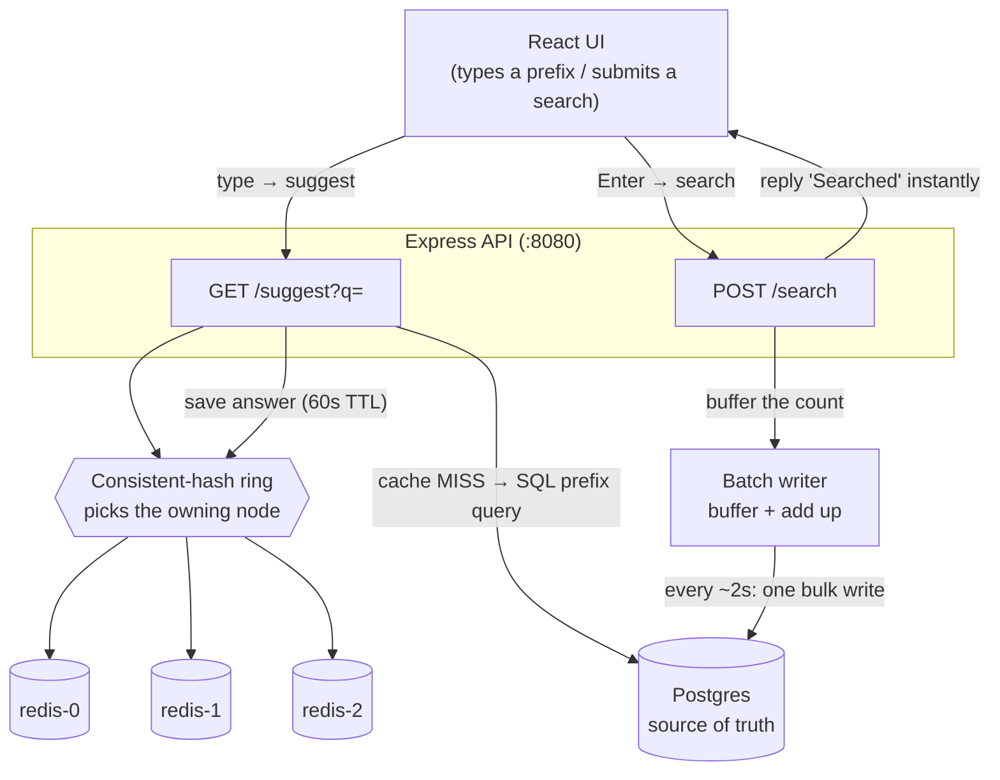

# Project Report — Search Typeahead System

A search-as-you-type suggestion system (like the autocomplete on Google or Amazon). As you type, it
shows the 10 most popular matching queries; when you submit a search it records it; and it stays fast
using a distributed cache and reduces database load using batched writes.

This report has the 5 required sections: (1) architecture, (2) dataset + loading, (3) API,
(4) design choices & trade-offs, (5) performance.

---

## 1. Architecture

### The idea in one line

Typing happens far more often than submitting, and it must feel instant. So we put a fast **cache**
in front of a reliable-but-slower **database**, and we **batch** the writes. The database stays the
single source of truth; everything else just makes it fast.

### The pieces

| Piece | What it is | Its job |
|---|---|---|
| **Postgres** | A database | The **source of truth** — the permanent store of every query and its count. |
| **Cache (3 Redis nodes)** | Fast in-memory stores | Keep **copies of recent answers** so most reads never touch the database. |
| **Consistent-hash ring** | Our routing code | Decide **which Redis node** holds which prefix, in a way that survives adding/removing nodes. |
| **Batch writer** | An in-memory buffer | Collect and **add up** searches, then write them to the DB in bulk (not one write per search). |
| **Recency ranking** | A scoring formula | Let queries that are **trending right now** rank above all-time favorites. |
| **React UI** | The frontend | The search box, live suggestions, and trending list the user sees. |

### Diagram



### What happens when you TYPE `ip` (`GET /suggest?q=ip`)

1. The UI waits ~200ms after you stop typing (**debounce**) so it doesn't call on every keystroke.
2. The **ring** picks the Redis node that owns `ip` (say `redis-1`).
3. **Cache hit?** Return the saved top-10 instantly — no database. (This is ~99% of requests.)
4. **Cache miss?** Ask Postgres: `SELECT query, count FROM queries WHERE query LIKE 'ip%' ORDER BY
   count DESC LIMIT 10`. Save that answer in `redis-1` (with a 60-second expiry), and return it. The
   next person who types `ip` gets a cache hit.

### What happens when you SUBMIT `iphone` (`POST /search`)

1. The API instantly replies `{"message":"Searched"}`. **It does not write to the database yet.**
2. It just adds the query to an in-memory buffer (`iphone: +1`). If 50 people search `iphone`, the
   buffer becomes `iphone: +50` — **one entry, not 50**.
3. Every ~2 seconds the **batch writer** writes all the summed counts to Postgres in **one** bulk
   statement, records the activity for trending, and clears the now-stale cache entries.

---

## 2. Dataset — source and loading

### Source

The dataset is **generated by us** (not downloaded), so it's reproducible and there's nothing to
fetch. `scripts/generate-dataset.ts` produces **~162,000 distinct realistic queries** (brands,
products, tech terms + modifiers like `price`, `review`, `near me`, years) and gives each a count
following a **Zipfian (power-law)** distribution — a few very popular queries and a long tail — like
real search traffic. A fixed random seed makes every run produce the same file.

> The assignment requires at least 100,000 queries; we generate ~162,000.

### How to load it

```bash
docker compose up -d        # start Postgres + 3 Redis nodes
cd backend
npm install
npm run dataset             # writes ../data/queries.csv (~162k rows)
npm run ingest              # bulk-loads the CSV into Postgres (idempotent)
```

The CSV looks like:

```
query,count
iphone,98213
iphone 15,71044
iphone charger,60000
java tutorial,40000
```

> Tip: `./run.sh setup` does all of the above in one command.

---

## 3. API documentation

Base URL (local): `http://localhost:8080`. Responses are JSON; errors return `{ "error": "..." }`.

| Method | Path | What it does |
|---|---|---|
| GET | `/suggest?q=<prefix>&mode=basic\|recency` | Up to 10 suggestions starting with the prefix |
| POST | `/search` | Submit a search (dummy reply + buffered count update) |
| GET | `/trending?limit=<n>` | Queries with the most recent activity |
| GET | `/cache/debug?prefix=<p>` | Which cache node owns a prefix (proves consistent hashing) |
| POST / DELETE | `/cache/nodes` `/cache/nodes/:id` | Add / remove a cache node at runtime (rebalancing demo) |
| GET | `/metrics` | Latency, cache hit rate, DB read/write counts, write-reduction, ring spread |

**`GET /suggest`** — `q` is the prefix (empty/missing → empty list; mixed case works). `mode` is
`basic` (sort by all-time count, the default) or `recency` (blend in recent activity).
```bash
curl "http://localhost:8080/suggest?q=iph"
```
```json
{ "suggestions": [ { "query": "iphone 15 pro for beginners free shipping", "score": 17352 } ],
  "source": "cache", "node": "redis-1", "mode": "basic" }
```
`source` is `cache` (Redis hit), `db` (cache miss, read from Postgres), or `empty` (no prefix).

**`POST /search`** — records a search, returns `202 { "message": "Searched" }`. It only **buffers**
the count (no synchronous DB write). Empty `q` → `400`.
```bash
curl -X POST localhost:8080/search -H 'Content-Type: application/json' -d '{"q":"iphone"}'
```

**`GET /trending`** — queries with the most recent activity, by 1h then 24h counts.
```json
{ "trending": [ { "query": "iphone case", "count1h": 25, "count24h": 25 } ] }
```

**`GET /cache/debug`** — shows which Redis node owns a prefix and where it sits on the ring (the
evidence that consistent hashing works).
```json
{ "prefix": "iph", "owningNode": "redis-0", "ringPosition": 4206117018, "hit": false,
  "health": { "redis-0": true, "redis-1": true, "redis-2": true },
  "ringStats": { "redis-0": 220, "redis-1": 269, "redis-2": 213 } }
```

**`GET /metrics`** — one endpoint with latency (incl. p95), cache hit rate, DB read/write counts,
batch write-reduction, and the ring distribution.

---

## 4. Design choices and trade-offs

Each is "we picked X because Y, and the cost is Z."

**Why a SQL prefix query for suggestions (`LIKE 'ip%'`).**
On a cache miss we read suggestions straight from Postgres with `WHERE query LIKE 'ip%' ORDER BY
count DESC LIMIT 10`. To keep this fast we add an index built with the `text_pattern_ops` operator
class, which turns `LIKE 'ip%'` into a quick **range scan** instead of a slow full-table scan
(verified with `EXPLAIN`). *Trade-off:* it hits the database on a miss — but the cache absorbs ~99%
of reads, so misses are rare; and keeping Postgres as the only place that holds the data means
there's no second copy to keep in sync. *(A classic alternative is an in-memory trie; we chose SQL
for simplicity and a single source of truth.)*

**Why a cache in front of the database (cache-aside).**
Reads vastly outnumber writes and a few hot prefixes get most of the traffic, so caching recent
answers serves the vast majority from memory (~99% hit rate measured). On a miss we read from
Postgres and save the answer. *Trade-off:* a cached answer can be slightly stale, so each entry
expires after 60 seconds and is also cleared when its counts change.

**Why a distributed cache with consistent hashing (not one cache, not `hash % N`).**
One cache box runs out of room and throughput, so we split the cache across 3 Redis nodes. To decide
which node owns a prefix we use a **consistent-hash ring** instead of `hash(key) % N`, because `% N`
reshuffles *almost every key* whenever a node is added or removed (which wipes the cache). With the
ring, adding a node only moves ~1/N of keys. *Trade-off:* a bit more code than `% N`, but it's the
difference between a cache that survives scaling and one that doesn't.

**Why batch writes (not write-on-every-search).**
Writing to the DB on every search would re-create the load we're trying to avoid. So we buffer
searches in memory, add up repeats (`iphone × 50` → one `+50`), and flush to the DB in bulk every
~2 seconds. *Trade-off:* if the app hard-crashes in those ~2 seconds, the buffered counts are lost —
fine for a popularity counter, and a graceful shutdown flushes the buffer first.

**Why recency ranking uses sliding time-windows.**
"Popular all-time" and "hot right now" are different, so we blend them:
`score = 3 × (last 1h) + 1.5 × (last 24h) + 1 × (all-time)`. Because the time windows *expire*, a
brief spike can't stay on top forever — no special decay job needed. *Trade-off:* recency results
need a quick window lookup, so they're recomputed a little more often than basic results.

**Why Postgres is the single source of truth.**
The cache is fast but *disposable* — it can be empty, stale, or cleared anytime. Postgres holds the
one permanent, correct copy that everything else is derived from, so if the cache is ever wrong the
truth is always one fallback away.

---

## 5. Performance report

Measured with `npm run bench` (3000 suggestion requests at 50 concurrent users using hot-skewed
prefixes; ~1000 search submissions across 50 distinct queries). The benchmark uses a fixed seed, so
runs are reproducible. Full data: `reports/perf.md` / `reports/perf.json`.

### Suggestion latency
| Metric | Value |
|---|---|
| Throughput | **~17,700 requests/sec** |
| p50 (median) | 2.5 ms |
| **p95** | **4.8 ms** |
| p99 | 6.0 ms |

### Cache hit rate
| Metric | Value |
|---|---|
| **Hit rate (warm)** | **98.8%** |

### Batch write-reduction
| Metric | Value |
|---|---|
| Search submissions | ~1000 |
| Actual DB writes | **~50** |
| **Writes saved** | **~950** (~20× fewer writes) |

### Cache key distribution across the 3 Redis nodes
| Node | Keys |
|---|---|
| redis-0 | 220 |
| redis-1 | 269 |
| redis-2 | 213 |

### What the numbers mean (in plain words)

- **It's fast.** Half of all suggestion requests finish in ~2.5 ms and 95% finish under ~4.8 ms,
  because ~99% of requests are served from the Redis cache and never touch the database. The rare
  miss is a single indexed prefix query, not a slow full-table scan.
- **It barely writes to the database.** ~1000 searches became only ~50 database writes, because the
  batch writer added up repeats before writing — about a **20× reduction**.
- **The cache is evenly spread.** The three Redis nodes hold a roughly equal share of keys (220 /
  269 / 213), thanks to the consistent-hash ring. Adding or removing a node moves only a small
  fraction of keys, so the cache survives scaling.

---

## Summary

The database holds the truth but is slow to hit on every keystroke, so a **distributed Redis cache**
serves ~99% of reads and a **batch writer** turns thousands of searches into a few bulk writes.
**Consistent hashing** lets the cache scale across nodes safely, and a **recency-aware ranking** lets
trending queries surface. Result: ~4.8 ms p95 suggestion latency, ~99% cache hit rate, and ~20×
fewer database writes.
